# Datenintegration und Analyse hochteurer Medikamente mit Neo4j

Es wurde ein Datenmodell mit der Graphdatenbank Neo4j entwickelt. Dabei wurden die Informationen der "Liste der hochteuren Medikamente/Substanzen" und weiterer Quellen in einem Graphen zusammengefasst. Graphen bestehen aus Knoten (engl. nodes) und Kanten (engl. relations). Knoten sind die Informationsobjekte (z.B. ein ATC-Code oder ein Medikament) und Kanten stellen die Beziehung zwischen den Knoten dar (z.B. ein Medikament `HAT_ATC` Code).

## Datenquellen

Folgende Datenquellen wurden verwendet:

- [Liste der hochteuren Medikamente/Substanzen 2025](https://www.swissdrg.org/de/akutsomatik/datenerhebung/erhebung-2026-daten-2025)
- [Zusatzentgelte von SwissDRG](https://www.swissdrg.org/de/akutsomatik/swissdrg-system-1402025/fallpauschalenkatalog), TARPSY und ST Reha
- [SwissDRG Antragsverfahren](https://antragsverfahren.swissdrg.org/de/swissdrg/proposals/public_index)
- [Spezialitätenliste](https://www.spezialitätenliste.ch/Default.aspx) des Bundesamtes für Gesundheit (BAG)
- [Strukturierte Arzneimittelinformationen (SAI)](https://sai.refdata.ch) der Stiftung Refdata (im Auftrag von SwissMedic)
- Daten der [European Medicines Agency (EMA)](https://www.ema.europa.eu/en/medicines/download-medicine-data)
- [ATC-Klassifikation](https://atcddd.fhi.no/atc_ddd_index/) der WHO

## Datenmodell

Das Datenmodell besteht aus 13 Labels (Knoten-Typen) und 14 unterschiedlichen Relationen.

Die Knoten handelt es sich um:

- Substanz: basiert auf den siebenstelligen ATC-Codes der SwissDRG Liste der hochteuren Medikamente/Substanzen sowie dem ATC-Index der WHO
- Tarif, Einheit, Verarbeitungsart und Zusatzangabe: gemäss der SwissDRG Liste der hochteuren Medikamente/Substanzen und dem dazugehörigen technischen Begleitblatt
- Zusatzentgelte: stationäre Zusatzentgelte für die Tarife SwissDRG, TARPSY und ST Reha
- Antrag: abgelehnte oder nicht rechenbare Anträge gemäss SwissDRG Antragsverfahren für Medikamente oder Zusatzentgelte
- Hierarchie: basiert auf den ATC-Index mit den Detailierungslevels 1, 3, 4 und 5 sowie den Angabe der Definded Daily Dose (DDD) auf Level 7, d.h. für den Knoten Substanz
- Produkt: basiert auf den Produktnamen der EMA oder Refdata ohne Unterteilung nach Packungen
- Spezialitätenliste: alle Packungen inkl. Preisangaben der Spezialitätenliste (SL) des Bundesamt für Gesundheit (BAG)
- Indikation, MeSH, Anwendungsgebiet: für welche Erkrankungen sind die Produkte indiziert gemäss EMA oder Refdata/SAI? Knoten basieren auf den Indikationstexten, die semikolongetrennt in mehrere Indikationen aufgeteilt wurden (aber kommagetrennte Indikationen sind nicht separat, sondern als ein gemeinsamer Knoten vorhanden); Indikation ist die Vereinigungsmenge von MeSH und Anwendungsgebiet

Zwischen den Knoten wurden diverse Relationen erstellt (teilweise Mehrfach-Relationen)

- GILT_FUER_TARIF: Relation einer Substanz der Liste der hochteuren Medikamente oder eines Zusatzentgeltes zum Tarif (zweifache Relation)
- HAT_EINHEIT: Relation einer Substanz der Liste der hochteuren Medikamente oder eines Zusatzentgeltes zur Einheit (zweifache Relation)
- HAT_VA: zweifache Relation einer Substanz der Liste der hochteuren Medikamente oder eines Zusatzentgeltes zur Verabreichungsart (VA)
- HAT_ZA: zweifache Relation einer Substanz der Liste der hochteuren Medikamente oder eines Zusatzentgeltes zur Zusatzangabe (ZA)
- HAT_ZE: Relation einer Substanz der Liste der hochteuren Medikamente zu ein Zusatzentgelt (ZE)
- HATTE_ANTRAG: Relation einer Substanz der Liste der hochteuren Medikamente zun Anträgen des Antragsverfahrens
- WAR_ATC_BIS: Relation einer Substanz zu sich selbst, falls der ATC-Code in der Vergangenheit geändert hat inkl. Relationenproperties
- NICHT_AUF_MEDI_LISTE: Relation einer Substanz zu sich selbst, falls es sich um einen ATC-Code handelt, der sich aktuell nicht auf der Liste der hochteuren Medikamente befindet
- IST_IN_ATC_GRUPPE: Relation einer Substanz zum ATC-Hierarchie-Level 5 oder vom ATC-Hierarchie-Level jeweils ein Hierarchie-Level hinauf
- HAT_ATC: Relation eines Produktes zu einer Substanz, wobei ATC-Codes der EMA und/oder von Refdata/SAI und/oder von der SL zu dieser Relation beitragen; die Quelle der Relation ist als Relationenpropertie vorhanden
- HATTE_ATC: Relation eines Produktes zu einer Substanz, wobei der ATC-Code zu einem früheren ATC-Code gehört, der in der Relation `WAR_ATC_BIS` hinterlegt ist
- INDIZIERT_FUER: Relation zwischen den Produkten und den Indikationsknoten (dreifache Relation)
- IST_AUF_SL: Relation eines Produktes zu einer konkreten Packung, falls sich die Packung auf der Spezialitätenliste befindet
- IST_AUCH_PRODUKT: Relation eines Produktes zu sich selbst, weil Produkte mit unterschiedlichen Indikationen die gleiche Bezeichnung haben können; diese Relation stellt sicher, dass keine Daten verloren gehen

Das Datenschema kann wie folgt visualisiert werden:

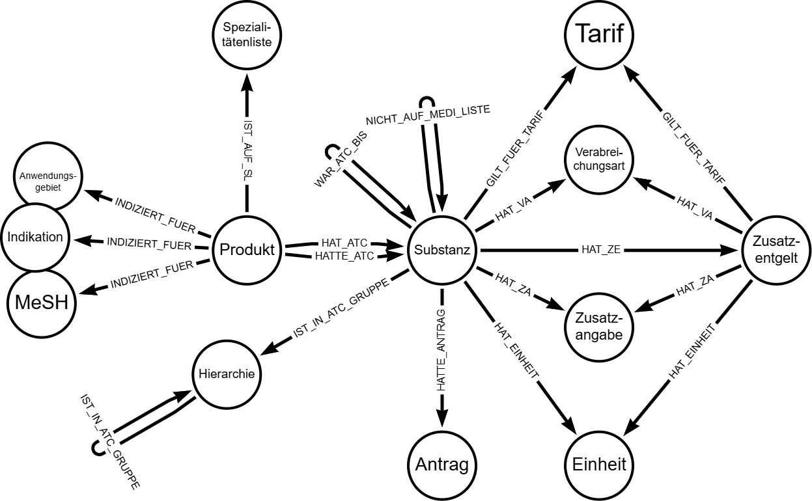

Die Labels haben folgende Properties:

| nodeLabels     | propertyName                | propertyTypes  |
|---------------|---------------------------|---------------|
| Substanz       | Name                         | String        |
| Substanz       | Zu erfassen seit             | Long          |
| Substanz       | Einschränkung                | String        |
| Substanz       | Einschränkung FR             | String        |
| Substanz       | Einschränkung IT             | String        |
| Substanz       | url                          | String        |
| Substanz       | DDD                          | StringArray, Double  |
| Substanz       | Unit                         | StringArray, String  |
| Substanz       | Level                        | Long          |
| Substanz       | Route                        | StringArray, String  |
| Substanz       | Note                         | StringArray, String  |
| Substanz       | Bezeichnung                  | String        |
| Substanz       | Bezeichnung EN               | String        |
| Substanz       | War auf Medi-Liste bis und mit Jahr | Long  |
| Substanz       | Bezeichnung FR               | String        |
| Tarif          | Name                         | String        |
| Zusatzangabe   | Name                         | String        |
| Zusatzangabe   | Bezeichnung                  | String        |
| Zusatzangabe   | Hinweis                      | String        |
| Verabreichungsart | Name                      | String        |
| Verabreichungsart | Bezeichnung               | String        |
| Verabreichungsart | Bezeichnung FR            | String        |
| Verabreichungsart | Bezeichnung IT            | String        |
| Einheit        | Name                         | String        |
| Einheit        | Bezeichnung                  | String        |
| Einheit        | Bezeichnung FR               | String        |
| Einheit        | Bezeichnung IT               | String        |
| Einheit        | Hinweis                      | String        |
| Zusatzentgelt      | Name                     | String        |
| Zusatzentgelt      | ATC                      | String        |
| Zusatzentgelt      | Version                  | String        |
| Zusatzentgelt      | ZE-Code                  | String        |
| Zusatzentgelt      | Zusatzangabe             | String        |
| Zusatzentgelt      | Einheit                  | String        |
| Zusatzentgelt      | Verabreichungsart        | String        |
| Zusatzentgelt      | ZE-Nr                    | String        |
| Zusatzentgelt      | url                      | String        |
| Produkt            | Name                     | String        |
| Produkt            | Mesh                     | String        |
| Produkt            | Indikation               | String        |
| Produkt            | Zulassungsinhaberin      | String        |
| Produkt            | Orphan Status            | String        |
| Produkt            | Generikum                | String        |
| Produkt            | Biosimilar               | String        |
| Produkt            | url                      | String        |
| Produkt            | IT                       | String        |
| Produkt            | ATC-EMA                  | String        |
| Produkt            | Anwendungsgebiet         | String        |
| Produkt            | Erstzulassung            | String        |
| Produkt            | Zulassungsnummer         | String        |
| Produkt            | ATC-SAI                  | String        |
| Produkt            | Aktive Substanz EMA      | String        |
| Produkt            | Praeparatename           | String        |
| Indikation, MeSH  | Name                         | String        |
| Indikation, Anwendungsgebiet  | Name              | String        |
| Hierarchie         | Name                     | String        |
| Hierarchie         | url                      | String        |
| Hierarchie         | Bezeichnung EN           | String        |
| Hierarchie         | Level                    | Long          |
| Spezialitätenliste | Name                     | String        |
| Spezialitätenliste | GTIN                     | String        |
| Spezialitätenliste | Zulassungsnummer         | String        |
| Spezialitätenliste | ExFactoryPreis           | Double        |
| Spezialitätenliste | PublikumsPreis           | Double        |
| Spezialitätenliste | Letzte Preis Änderung    | Date          |
| Spezialitätenliste | ATC-SL                   | String        |
| Antrag             | Tarifsystem              | String        |
| Antrag             | Partner                  | String        |
| Antrag             | Antragsjahr              | Long          |
| Antrag             | Status                   | String        |
| Antrag             | Antragsnummer            | String        |

Bei fünf Relationen gibt es Properties:

| relType          | propertyName                 | propertyTypes  |
|-----------------|-----------------------------|---------------|
| HAT_ZA         | null                          | null          |
| HAT_VA         | null                          | null          |
| HAT_EINHEIT    | null                          | null          |
| HAT_ZE         | null                          | null          |
| INDIZIERT_FUER | Quelle                        | String        |
| IST_AUF_SL     | null                          | null          |
| GILT_FUER_TARIF| null                          | null          |
| IST_AUCH_PRODUKT | null                        | null          |
| IST_IN_ATC_GRUPPE | null                      | null          |
| WAR_ATC_BIS    | Gültig bis und mit Jahr       | Long          |
| WAR_ATC_BIS    | Früherer ATC                  | String        |
| HAT_ATC        | Quelle                        | String        |
| NICHT_AUF_MEDI_LISTE | null                   | null          |
| HATTE_ANTRAG   | Art                           | String        |
| HATTE_ATC      | Quelle                        | String        |

## Einführung in Neo4j Bloom/Explore

Neo4j Bloom ist ein Tool, das es ermöglicht, Graphdatenbanken visuell zu erkunden und zu analysieren. Es bietet eine benutzerfreundliche Oberfläche, um komplexe Datenbeziehungen zu verstehen und zu visualisieren. Neo4j Explore ist die Cloud-Version von Neo4j Bloom und bietet grundsätzlich die gleichen Funktionen und eine sehr ähnliche Benutzeroberfläche. Die folgenden drei Youtube-Videos bieten einen gute Einführung in Neo4j Bloom/Explore.

- [Near Natural Language Search in Bloom](https://youtu.be/9rL8O0lsuDc?si=nBTUzCShKzVu3qZY) (Video Nr.2 in Bloom Series), Dauer: 6:42 Minuten
- [Exploration from Bloom Canvas](https://youtu.be/7LHXYKAu9Nk?si=F--zt1UG8sa0_bbP) (Video Nr.3 in Bloom Series), Dauer: 6:54 Minuten
- [Exploring the WorldCup Graph with Neo4j Bloom](https://youtu.be/6RWK3e_-hbk?si=da9JshEHqaXSpZHW), Dauer: 10:59 Minuten

Optional vermittelt das ausführliche Video [Training Series - Getting started with Neo4j Bloom](https://www.youtube.com/live/7yS2e4p0_H4?si=AZQItNAICAe_-BPH) einen umfassenden Einblick in das System. Für normale Anwender ist das Video ab Zeitpunkt 32:45 bis Zeitpunkt 1:45:50 relevant. Der Rest ist eher für Entwickler und Administratoren gedacht.

Weitere Einführungsdokumente findet man beispielweise bei

- [Neo4j Explore Qiock Start](https://neo4j.com/docs/aura/explore/explore-quick-start)
- [Neo4j Bloom User Guide](https://development.neo4j.dev/docs/bloom-user-guide/current/bloom-visual-tour/bloom-overview)

## Analyse des Datenmodells

Das Datenmodell wurde mit Hilfe von cypher-Code in Neo4j implementiert. Anstatt Neo4j Bloom können Datenanalysen mit Coding-Erfahrung den Neo4j Browser nutzen. Hier wird  die Analyse mit dem No-/Low-Code-Tool Neo4j Bloom/Explore gezeigt. Der Bereich, in dem der Graph visualisert wird, nennt sich Scene.

### Analyse mit Freitextsuche

Die vermutlich einfachste Art ist die Suche nach Freitext im Suchfenster oben links. Besonders geeignet ist die Suche nach:

- ATC-Codes
- Produkt-Bezeichnungen
- Indikationen

Durch Auswahl der Suchtreffer mit Tab und mit Bestätigung der Suche mit Enter oder dem Dreieck-Symbol am rechten Rand der Suchleiste, werden die Knoten in der Scene dargestellt.

Beispiel: Suche nach dem Begriff "phesgo"

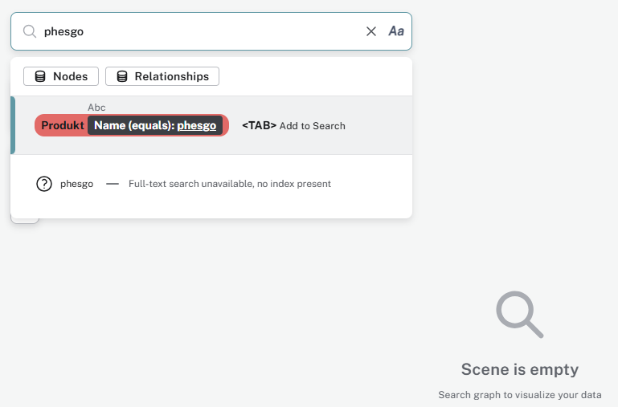

Nachdem der Suchbegriff mit dem Tab (oder Mausklick auf die Auswahl) bestätigt wurde, kann die Suche mit dem "Play-Button" (nach rechts gerichtetes Dreieck im Kreis) am rechten Rand des Suchfeldes ausgeführt werden.

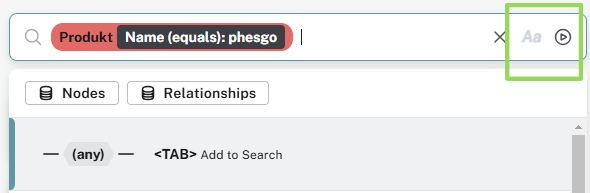

Falls Knoten gefunden wurden, wird dies direkt unter dem Suchfeld bestätigt und der/die Knoten angezeigt.

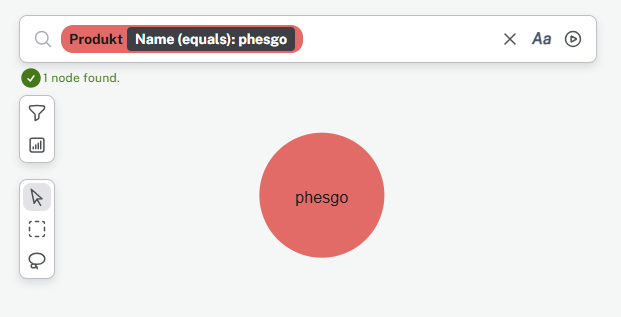

Die Farbe spielt hier keine Rolle und kann in anderen Perspektiven abweichen. Mit Doppelklick auf einen Knoten werden die Properties angezeigt.

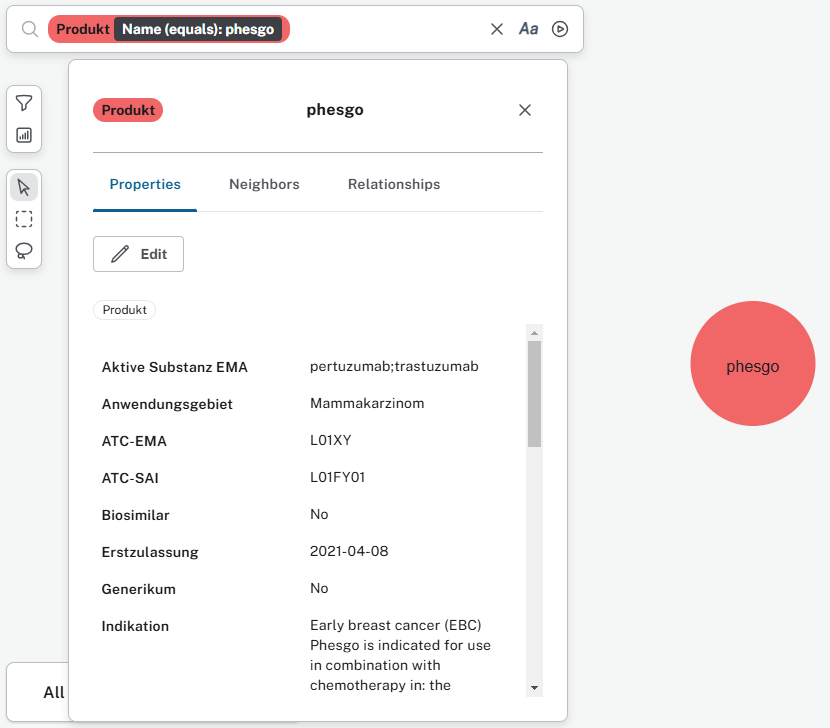

Auch die Nachbarknoten und die Relationen können in den Untermenues dargestellt, gefiltert oder mit Doppelklick in die Scene hinzugefügt werden.

### Analyse mit visuellen Graph-Pfaden

Beim Klick in das Suchfenster öffnet sich die Liste mit den Knoten und Relationen. Diese können wahlweise mit der Tabulator-Taste oder Mausklick ausgewählt werden. Die Pfade des Datenmodells können somit analysiert werden. Hier wird beispielsweise das Label Zusatzentgelt analysiert.

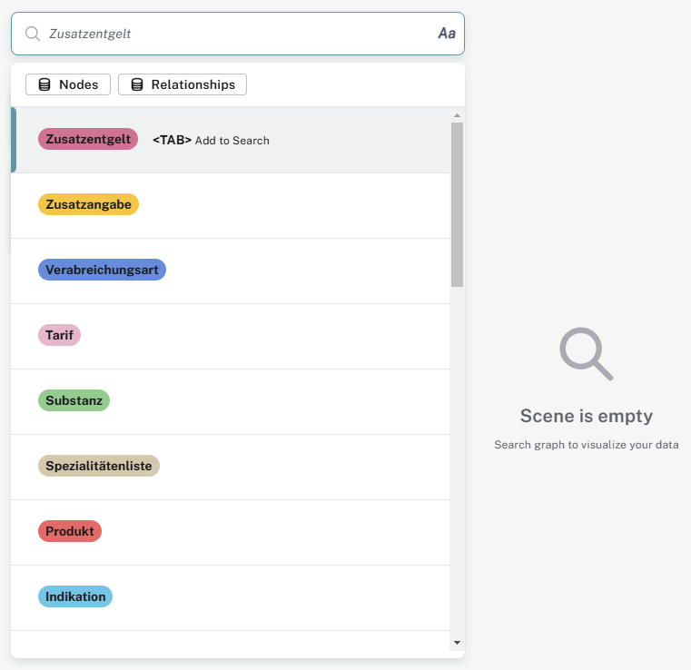

Nach der ersten Auswahl kann man zudem nach Properties auswählen und Filterwerte eintragen. Hier wird nach ZE-Nummern gefiltert, wobei einer von diversen Vergleichsoperationen (gleich, nicht gleich, enthält, beginnt mit, endet mit) gewählt werden kann.

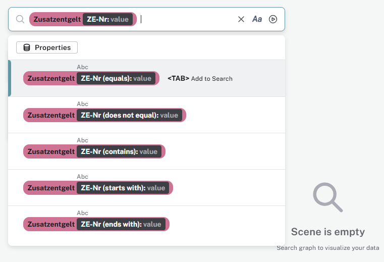

Die Filterausprägung kann mit der Tastatur eingegeben und mit Tab bestätigt werden. Manchmal reagiert das System mit leichter Verzögerung, sodass es zu Doppeleingaben kommen kann. Diese können mit "Backspace" wieder entfernt werden.

Wenn die Filterwerte erfolgreich eingetippt wurden, kann der weitere Pfad analysiert werden. Es werden verfügbare Relationen angezeigt oder "irgendeine" Relation kann gewählt werden zum nächsten Label. Hier wird die Verbindung zur Einheit gesucht.

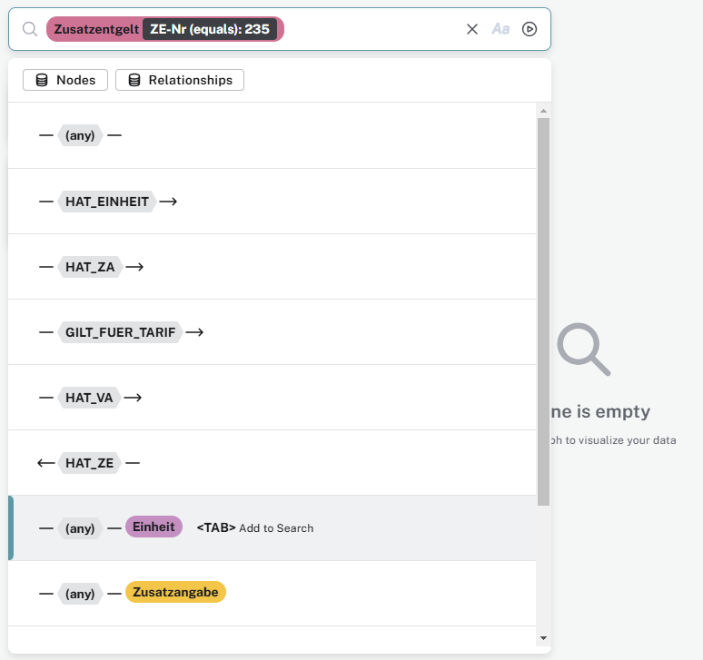

Nach der Bestätigung mit dem "Play-Button" oder Enter wird der gefundene Pfad  dargestellt und die Zahl der Knoten kurzzeitig unter dem Suchfenster eingeblendet.

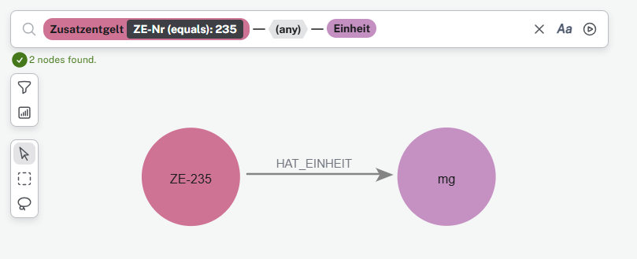

### Analyse mit Search-Phrases

Falls Abfragen in einer Perspektive gespeichert sind, können diese sog. "Search Phrases" für die Analyse der Daten genutzt werden. Search Phrases erscheinen nach dem Klick in das Suchfenster ohne Knoten-Symbol oder -Farbe, sondern mit einer kurzen Beschreibung. Variablen in den Search Phrases erkennt man am Dollar-Zeichen $. Search Phrases können mit Tab/Klick ausgewählt werden.

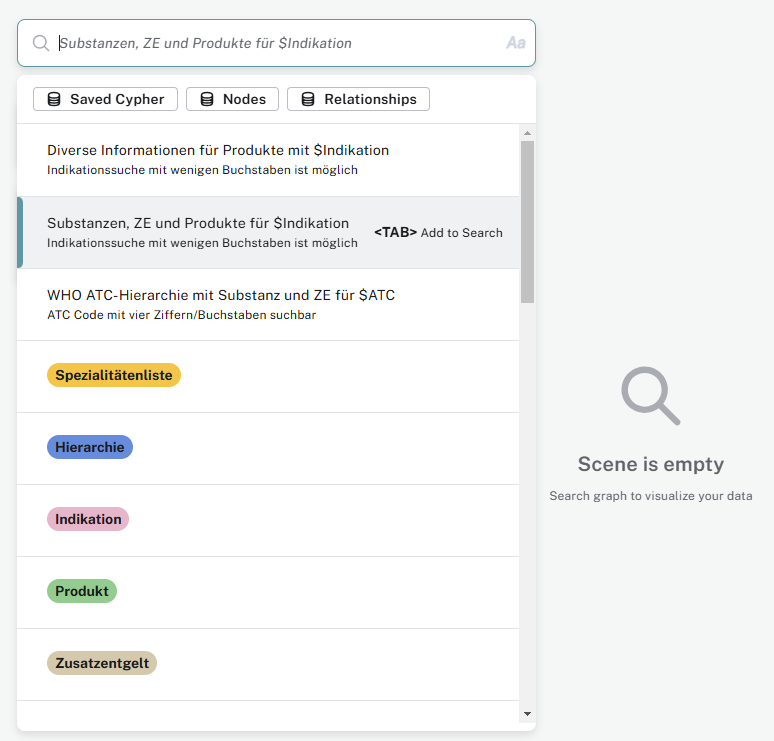

Die gesuchten Variablen können als Freitext eingegeben werden. Hier wird nach dem Begriff "ovar" gesucht.

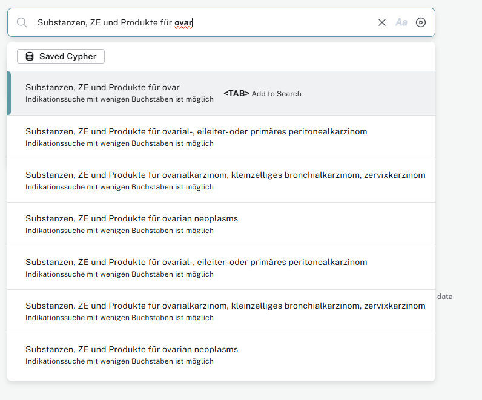

Es kann entweder eine konkrete gefundener Treffen aus der Suchliste ausgewählt oder der allgemeine Begriff (hier "ovar") bestätigt werden. Mit Enter oder Klick auf den "Play-Button" werden die gefundenen Knoten in der Scene dargestellt.

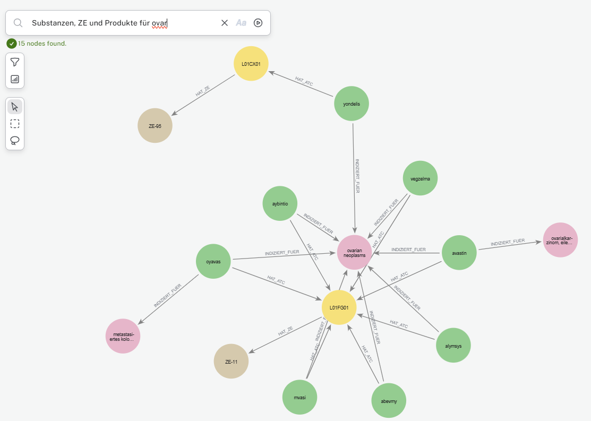

### Analyse mit Knoten-Funktionen und Search-Actions

Innerhalb einer Scene können ein oder mehrere Knoten und dessen Graph mit Hilfe der Knoten-Funktionen analysiert werden. Durch Rechtsklick auf den/die Knoten öffnet sich ein Auswahlmenü. Dort können Details zu den Knoten angezeigt werden, dieser oder alle anderen Knoten lassen sich ausblenden oder Relationen können dargestellt werden. Im Untermenü "Expand" werden die vorhandenen Relationen eines konkreten Knoten aufgelistet. Diese Verbindungen lassen sich der Scene hinzufügen.

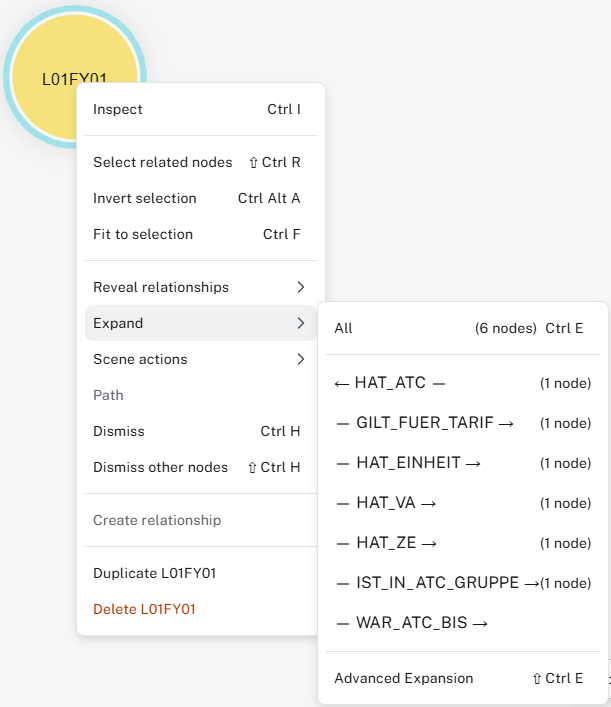

Bei Scene Actions handelt es sich um vorbereitete Abfragen, die einen oder mehrere Knoten erweitern. Die Scene Actions werden nur dann ausgeführt, wenn ein Knoten und die Scene Action zueinander passen. Im Beispiel unten kann die WHO ATC-Hierarchie eingeblendet werden, da es sich beim ausgewählten Knoten um eine Substanz handelt. Die Produkt-Informationen werden nicht angezeigt, weil sich die zweite Scene Action nur auf Prdoukt-Knoten bezieht.

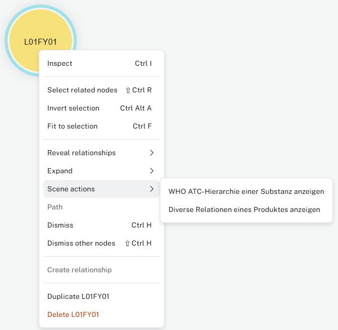

Es gibt weitere Möglichkeiten, das Medikamenten-Graph-Datenmodell zu analysieren. Die oben erwähnten Video und Dokumente zeigen noch mehr Funktionalitäten. Ein grundlegendes Verständnis des allgemeinen Datenschemas hilft sehr der Analyse des SwissDRG Medikamenten Graphen.
